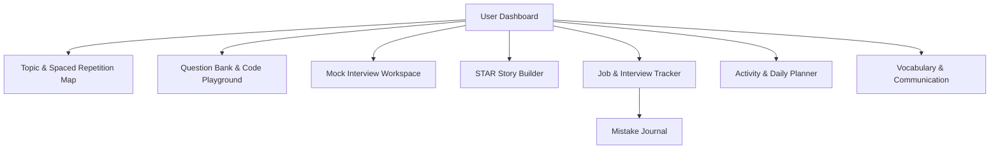

# Interview Preparation Tracker — Use Case & Feature Documentation

The **Preparation Tracker** is a comprehensive, centralized digital workspace designed for candidates preparing for challenging technical, behavioral, and coding interviews. It replaces scattered spreadsheets, flashcard apps, text notes, and application tracking boards with a cohesive, data-driven preparation environment.

---

## 1. Core Use Cases & Target Audience

### A. The Tech Candidate (Software Engineer / DevOps / Data Science)
*   **The Problem**: Needs to master dozens of coding patterns, system design concepts, database architectures, and language-specific details without forgetting older concepts.
*   **How the App Solves It**: Provides a dedicated **Code Playground** with automated tests, a **Topic Map** driven by spaced-repetition scheduling (SM-2 algorithm), and **Roadmaps** for structured learning paths.

### B. The Behavioral Round Candidate (Managers / Product Managers / Engineers)
*   **The Problem**: Struggling to structure answers, rambling during behavioral questions, and forgetting key projects or leadership examples.
*   **How the App Solves It**: Provides the **STAR Story Builder** (Situation, Task, Action, Result) to document past professional achievements, graded by AI for impact and clarity.

### C. The Active Job Seeker (Multi-Company Applications)
*   **The Problem**: Managing active loops across multiple companies, forgetting what questions were asked in previous rounds, and not learning from interview mistakes.
*   **How the App Solves It**: Includes an **Interview & Job Application Tracker** linked to a **Mistake Journal**, turning interview failures into scheduled learning tasks.

### D. The Non-Native English / Communication-Focused Candidate
*   **The Problem**: Struggling with vocal clarity, pacing, vocabulary, filler words (e.g., *"um"*, *"like"*), or pronunciation during live interviews.
*   **How the App Solves It**: Uses the **Mock Interview Workspace** with vocal speech analytics (tracking filler words), and a **Vocabulary Builder** to build pronunciation confidence.

---

## 2. Feature Architecture & System Workflows

### 1. Subject & Topic Management with Spaced Repetition (SM-2)
Instead of studying topics randomly, candidates organize content into Subjects (e.g., *Systems Design*, *Data Structures*) and Topics (e.g., *Consistent Hashing*, *Tries*).
*   **Active Recall**: Candidates rate their confidence and recall score after review.
*   **SM-2 Spaced Repetition**: The application uses the SuperMemo-2 (SM-2) algorithm (`easeFactor`, `intervalDays`) to dynamically calculate and suggest the `nextRevisionDate`.
*   **Dependencies**: Topics can list `dependencyIds`, preventing candidates from studying advanced concepts before mastering prerequisites.

### 2. Question Bank & Code Playground
*   **Theory recall**: Log questions, ideal answers, difficulty levels, and sources (e.g., *LeetCode, Course, Book*).
*   **Practice Coding IDE**: An in-app editor supporting Java, Python, C++, JavaScript, TypeScript, Go, and Kotlin. 
*   **Automatic Evaluation**: Runs test cases against candidate code, measuring execution speed and memory footprints.
*   **AI Feedback**: Submissions can be analyzed by Gemini/AI models to provide optimization hints, style guides, and alternative approaches.

### 3. AI-Powered Mock Interview Workspace
A simulation room designed to reduce real-world interview anxiety.
*   **AI Interviewer**: Select interview types (e.g., *System Design, Behavioral, Technical*) and experience levels. The app speaks or displays questions.
*   **Vocal Recording**: Record answers via audio stream, enabling candidates to hear their delivery back.
*   **Speech Analysis**: Tracks **filler words** ("um", "ah", "like") and averages response times.
*   **Camera Gesture Control**: Hand gestures (detected via camera) allow hands-free navigation (e.g., pausing, advancing questions) so the candidate can focus on posture and presentation.

### 4. STAR Story Builder
Behavioral interviews (like Amazon's Leadership Principles) require structured, results-oriented storytelling.
*   **Structure**: Prompts candidates to break stories into:
    *   **Situation**: The background context.
    *   **Task**: The challenge or goal.
    *   **Action**: The exact steps they personally took.
    *   **Result**: The quantifiable outcome.
*   **AI Evaluation**: Evaluates stories and provides an AI score assessing the impact and clarity of the actions and results.

### 5. Vocabulary & Communication Booster
Designed to help candidates articulate thoughts with precise terminology.
*   **Phonetics & Translation**: Lists professional words with English meanings, regional translation (e.g., Marathi), and phonetic spelling (e.g., Devanagari) to help with pronunciation.
*   **AI Word Generation**: Dynamically pull definitions, synonyms, and context sentences for advanced industry terminology.

### 6. Job Tracker & Mistake Journal
Closes the loop between applying for jobs and mastering skills.
*   **Application Kanban/List**: Tracks statuses from *Applied* to *Offer Received*.
*   **Interview Feedback Logs**: Logs specific questions asked, questions missed, and notes.
*   **Mistake Journaling**: When a question is missed in an interview, the candidate writes a post-mortem entry. This links back to the **Topic Map** to schedule immediate revision, turning a failure into a target study session.

### 7. Daily Activity Planner & Personal Reminders
Establishes consistency, the single most critical factor in interview success.
*   **Study Logs**: Log hours dedicated to different categories (e.g., *DSA*, *Communication*, *Fitness*).
*   **Medicine & Health Reminders**: Tracks health habits (hydration, medication, breaks) to prevent burnout.
*   **Streaks**: Calculates daily completion streaks to gamify consistency.

---

## 3. Technology Stack Summary

*   **Frontend**: React 19, TypeScript, Tailwind CSS, Vite.
*   **Database & Auth**: Firebase Auth and Cloud Firestore (fully protected by zero-trust security rules defined in `firestore.rules`).
*   **State Management**: React Context (`DatabaseContext.tsx`) managing real-time Firestore synchronization and caching.
*   **Speech & Media**: Custom voice recorder interfaces, Web Speech API integration.
*   **AI Integration**: Cerebras, Groq, and Google Gemini API support for evaluations, feedback, and study assistance.
*   **Analytics**: Recharts engine visualizing preparation readiness, session distribution, and study streaks over time.
*   **PWA / Mobile Native**: Capacitor config for packaging into Android/iOS applications, coupled with an offline metadata structure.
